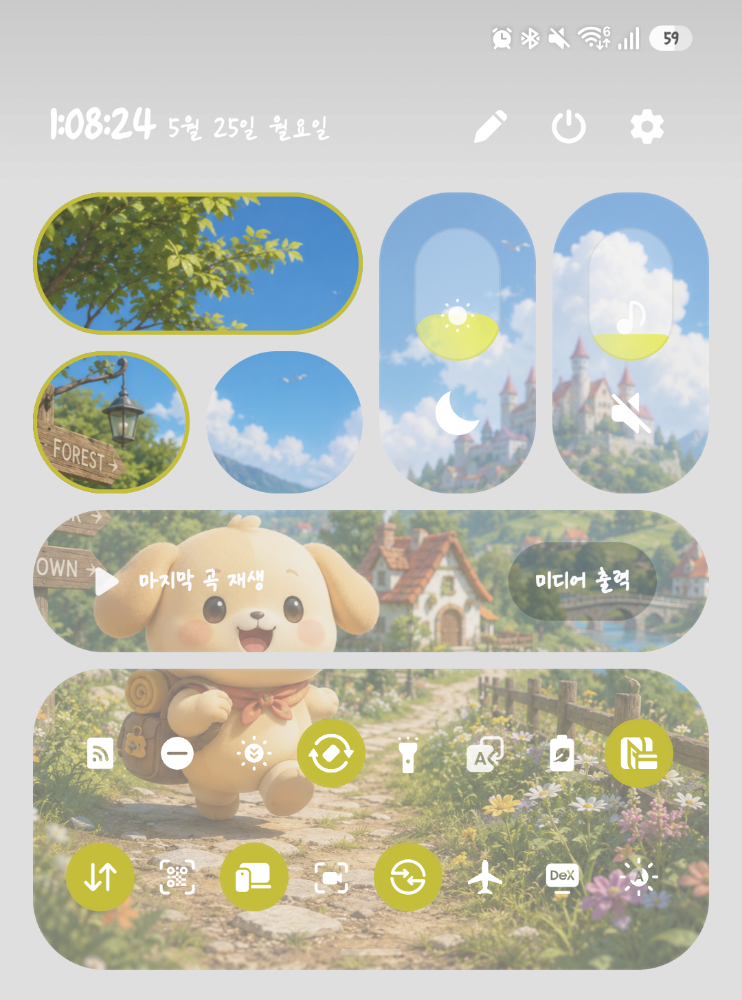

# QuickStar Image Slicer

Samsung Galaxy **One UI 8.5** 상단바 빠른 설정(QuickStar) 버튼에 나만의 이미지를 적용하기 위한 이미지 분할 도구입니다.



---

## 주요 기능

- **커스텀 그리드 레이아웃** — 행(H) × 열(W) 크기를 직접 지정하고, 드래그로 버튼 영역을 자유롭게 배치
- **다양한 이미지 업로드** — 파일 선택, 드래그&드롭, Ctrl+V 붙여넣기 지원
- **비율 고정 크롭** — 그리드 비율(10H : 11W)에 맞게 자동 고정된 크롭 박스, 8방향 핸들 조작 가능
- **분할 미리보기** — 레이아웃 위에 컬러 아웃라인으로 각 버튼 영역 시각화
- **타일 유형 선택** — 버튼 박스·밝기 조절·볼륨 조절 등 특수 타일은 원본 밝기 유지, 나머지는 자동으로 어둡게 처리
- **ZIP 다운로드** — 모든 분할 이미지를 한 번에 ZIP 파일로 저장

---

## 사용 방법

### Step 1 — 레이아웃 설정
세로(H) × 가로(W) 그리드 크기를 입력하고 **그리드 만들기**를 클릭합니다.  
셀을 드래그해서 버튼 영역을 지정하세요. 지정된 영역을 클릭하면 취소됩니다.

### Step 2 — 이미지 업로드
분할할 이미지를 업로드합니다.  
파일 선택, 드래그&드롭, 또는 **Ctrl+V**로 클립보드에서 바로 붙여넣기 할 수 있습니다.

### Step 3 — 이미지 자르기
크롭 박스를 드래그해서 그리드에 맞출 영역을 선택합니다.  
크롭 박스는 그리드 비율(10H : 11W)에 자동으로 고정됩니다.

### Step 4 — 분할 & 다운로드
분할 미리보기에서 각 타일의 위치를 확인합니다.  
**버튼 박스 · 미디어 플레이어 · 밝기 조절 · 볼륨 조절**에 해당하는 타일을 클릭해서 체크하세요.

| 타일 유형 | 내보내기 처리 |
|-----------|-------------|
| 체크된 타일 (특수 타일) | 원본 밝기 그대로 |
| 체크 안 된 타일 | 밝기 92% + 흰색 19.2% 혼합 |

> ⚠️ 미디어 플레이어는 음악 재생 시 설정한 이미지가 나오지 않으므로 설정을 권장하지 않습니다.  
> 버튼 박스는 확장할 때 설정한 이미지가 동시에 확장될 수 있습니다.

**ZIP 다운로드** 버튼을 누르면 `image_1.png`, `image_2.png`, ... 형태로 저장됩니다.

---

## 그리드 수학

Samsung One UI QuickStar 그리드의 단위를 `k`라 할 때:

| 항목 | 값 |
|------|-----|
| 셀 콘텐츠 크기 | 9k(높이) × 10k(너비) |
| 셀 테두리 | 각 변 0.5k |
| 셀 전체 크기 | 10k × 11k |
| 전체 그리드 | 10H × k 높이, 11W × k 너비 |

---

## 기술 스택

- **HTML / CSS / JavaScript** — 순수 바닐라, 빌드 도구 없음
- **[JSZip](https://stuk.github.io/jszip/)** — 브라우저에서 ZIP 생성 (CDN)

---

## 파일 구조

```
├── index.html
├── css/
│   └── style.css
├── js/
│   ├── app.js          # 전역 상태 및 스텝 네비게이션
│   ├── step1-grid.js   # 그리드 레이아웃 빌더
│   ├── step2-upload.js # 이미지 업로드
│   ├── step3-crop.js   # 크롭 도구
│   └── step4-slice.js  # 분할 미리보기 & ZIP 다운로드
└── images/
    ├── sample_image.png
    ├── sample_before.png
    └── sample_after.png
```

---

## 실행 방법

별도 설치나 빌드가 필요 없습니다. `index.html`을 브라우저에서 열면 바로 실행됩니다.

```bash
# 로컬 서버 없이 파일로 바로 열기
open index.html   # macOS
start index.html  # Windows
```

---

## 제작자

**[박상연](https://sangyeon-park.github.io/)** — [GitHub](https://github.com/sangyeon-park/Image-Cutter-for-QuickStar)
