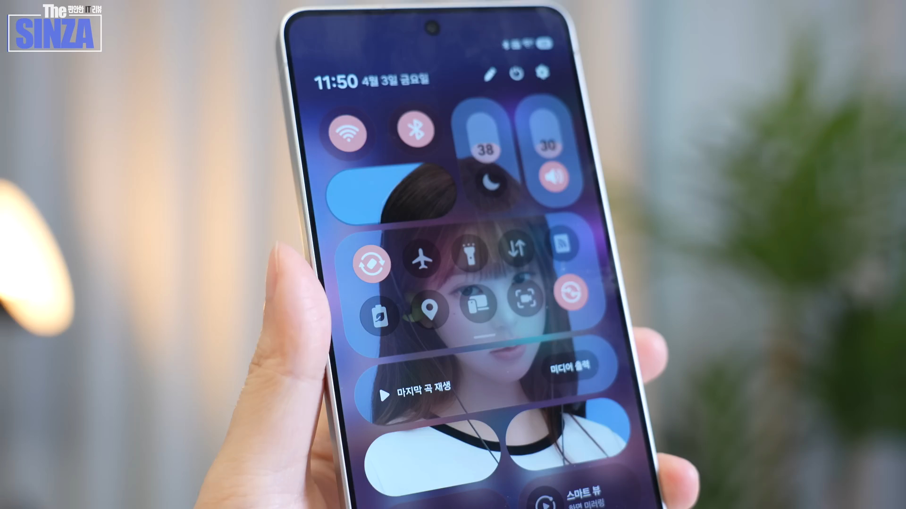

# QuickStar Image Slicer

An image slicing tool for applying your own image to the Quick Settings (QuickStar) buttons on the Samsung Galaxy **One UI 8.5** status bar.

Samsung Galaxy **One UI 8.5** 상단바 빠른 설정(QuickStar) 버튼에 나만의 이미지를 적용하기 위한 이미지 분할 도구입니다.


---

## Features / 주요 기능

- **Custom grid layout** — Set the rows (H) × columns (W) yourself, and freely arrange button regions by dragging cells.

  **커스텀 그리드 레이아웃** — 행(H) × 열(W) 크기를 직접 지정하고, 드래그로 버튼 영역을 자유롭게 배치

- **Multiple image upload methods** — Supports file picker, drag-and-drop, and Ctrl+V paste.

  **다양한 이미지 업로드** — 파일 선택, 드래그&드롭, Ctrl+V 붙여넣기 지원

- **Aspect-locked crop** — The crop box is automatically locked to the grid ratio (10H : 11W), with 8-direction handles.

  **비율 고정 크롭** — 그리드 비율(10H : 11W)에 맞게 자동 고정된 크롭 박스, 8방향 핸들 조작 가능

- **Slice preview** — Each button region is visualized with a colored outline on top of the layout.

  **분할 미리보기** — 레이아웃 위에 컬러 아웃라인으로 각 버튼 영역 시각화

- **Tile type selection** — Special tiles (Button box, Brightness, Volume, etc.) keep the original brightness; the rest are automatically dimmed.

  **타일 유형 선택** — 버튼 박스·밝기 조절·볼륨 조절 등 특수 타일은 원본 밝기 유지, 나머지는 자동으로 어둡게 처리

- **ZIP download** — Save all sliced images at once as a ZIP file.

  **ZIP 다운로드** — 모든 분할 이미지를 한 번에 ZIP 파일로 저장

- **Multilingual UI** — Switch between English, Korean, and Chinese from the language button at the top-right.

  **다국어 지원** — 우측 상단 언어 버튼에서 한국어 / English / 中文 전환 가능

---

## How to Use / 사용 방법

> 📱 This tool only applies to Galaxy smartphones that support **GoodLock on One UI 8.5 or later**. Please check that your device meets these requirements before proceeding.
>
> 📱 본 설정은 **One UI 8.5 버전 이상의 GoodLock을 지원하는 Galaxy 스마트폰**에서만 적용 가능합니다. 사용 중이신 기종이 조건에 맞는지 먼저 확인해 주세요.

### Step 1 — Layout / 레이아웃 설정

Enter the grid size (H × W) and click **Build grid**. Drag cells to assign button regions; click a selected region to deselect it.

세로(H) × 가로(W) 그리드 크기를 입력하고 **그리드 만들기**를 클릭합니다. 셀을 드래그해서 버튼 영역을 지정하세요. 지정된 영역을 클릭하면 취소됩니다.

### Step 2 — Image Upload / 이미지 업로드

Upload the image to be sliced. Use the file picker, drag-and-drop, or paste directly from the clipboard with **Ctrl+V**.

분할할 이미지를 업로드합니다. 파일 선택, 드래그&드롭, 또는 **Ctrl+V**로 클립보드에서 바로 붙여넣기 할 수 있습니다.

### Step 3 — Crop / 이미지 자르기

Drag the crop box to select the region to match the grid. The crop box is automatically locked to the grid ratio (10H : 11W).

크롭 박스를 드래그해서 그리드에 맞출 영역을 선택합니다. 크롭 박스는 그리드 비율(10H : 11W)에 자동으로 고정됩니다.

### Step 4 — Slice & Download / 분할 & 다운로드

Check the position of each tile in the slice preview. Click the tiles that correspond to **Button box · Media player · Brightness · Volume** to mark them as special.

분할 미리보기에서 각 타일의 위치를 확인합니다. **버튼 박스 · 미디어 플레이어 · 밝기 조절 · 볼륨 조절**에 해당하는 타일을 클릭해서 체크하세요.

| Tile type / 타일 유형 | Export processing / 내보내기 처리 |
|---|---|
| Checked (special) / 체크된 타일 (특수 타일) | Original brightness / 원본 밝기 그대로 |
| Unchecked / 체크 안 된 타일 | Brightness 92% + 19.2% white mix\* / 밝기 92% + 흰색 19.2% 혼합\* |

> ⚠️ Media player is not recommended — the chosen image will not appear during music playback. The button box may expand the set image when expanded.
>
> ⚠️ 미디어 플레이어는 음악 재생 시 설정한 이미지가 나오지 않으므로 설정을 권장하지 않습니다. 버튼 박스는 확장할 때 설정한 이미지가 동시에 확장될 수 있습니다.

Click the **Download ZIP** button to save the result as `image_1.png`, `image_2.png`, …

**ZIP 다운로드** 버튼을 누르면 `image_1.png`, `image_2.png`, ... 형태로 저장됩니다.

#### After Download / 다운로드 후

Extract the downloaded ZIP file on your phone, then go to **GoodLock → QuickStar → Edit Panel Style** and apply each image to its tile one by one.

다운로드한 ZIP 파일을 휴대폰에서 압축 해제한 뒤, **GoodLock → QuickStar → 패널 스타일 편집**에서 각 타일에 이미지를 하나씩 적용해 주세요.

---

## File Structure / 파일 구조

```
├── index.html
├── css/
│   └── style.css
├── js/
│   ├── app.js          # Global state and step navigation / 전역 상태 및 스텝 네비게이션
│   ├── i18n.js         # Language switching (EN / KO / ZH) / 다국어 전환
│   ├── step1-grid.js   # Grid layout builder / 그리드 레이아웃 빌더
│   ├── step2-upload.js # Image upload / 이미지 업로드
│   ├── step3-crop.js   # Crop tool / 크롭 도구
│   └── step4-slice.js  # Slice preview & ZIP download / 분할 미리보기 & ZIP 다운로드
└── images/
    ├── sample_image.png
    ├── sample_before.png
    ├── sample_after.png
    └── sample_TheSINZA.jpeg
```

---

## How to Run / 실행 방법

No install or build required. Just open the link below in your browser:

별도 설치나 빌드가 필요 없습니다. 아래 링크를 브라우저에서 열면 바로 실행됩니다:

👉 **<https://sangyeon-park.github.io/Image-Slicer-for-QuickStar/>**

---

## Motivation / 동기

One UI 8.5's GoodLock **QuickStar** module lets users edit the style of the Quick Settings panel. You can drop an image into each tile individually, but you can also split one large image and place its pieces across multiple tiles. This technique has been featured in a YouTube video by **TheSINZA**, but doing it by hand takes a considerable amount of time for most users. The idea behind this project was to save some of that time: just feed in the image and your status bar layout, and let the tool export the sliced pieces for you.

One UI 8.5의 GoodLock **QuickStar**는 빠른 설정 패널의 스타일을 편집하는 기능을 제공합니다. 각 타일에 이미지를 개별로 넣을 수도 있지만, 하나의 큰 이미지를 여러 타일에 걸쳐 쪼개어 배치할 수도 있습니다. 이 방법은 유튜버 **더신자(TheSINZA)** 님의 영상에서도 소개된 적이 있지만, 일반 사용자가 직접 적용하기에는 시간이 꽤 많이 소요됩니다. 이미지와 상단바 레이아웃만 입력하면 쪼개진 이미지를 자동으로 내보내 주는 도구가 있다면 좋겠다는 생각에서 이 프로젝트를 시작했습니다.



*[Image from TheSINZA's YouTube video / TheSINZA 채널 영상의 이미지](https://youtu.be/K2A-MnbvOos?si=j7R-cXSX0ypbjCAU)*

---

## Limitation / 한계

\* **Why brightness 92% + 19.2% white mix?**

&nbsp;&nbsp; **왜 밝기 92% + 흰색 19.2% 혼합인가?**

Samsung One UI automatically applies translucency to control tiles (Button box, Media player, Brightness, Volume) so the image on those tiles appears dimmed, while every other tile is rendered at the original image. Even if you supply an image that already has built-in transparency, One UI ignores the alpha channel of the source image. To make the brightness difference between tiles look as natural as possible, we adopted the correction above. If you know a better approach, please share it.


삼성 One UI는 컨트롤 타일(버튼 박스·미디어 플레이어·밝기 조절·볼륨 조절)에는 자동으로 투명도를 적용해 이미지가 연하게 표시되지만, 그 외 타일은 원본 이미지를 그대로 표시합니다. 투명도를 미리 적용한 이미지를 넣어도 One UI가 원본 이미지의 알파 채널을 사용하지 않기 때문에, 타일 간의 밝기 차이를 최대한 자연스럽게 맞추기 위해 위와 같은 보정 방식을 채택했습니다. 더 나은 방법을 알고 계신다면 공유 부탁드립니다.

\- **Landscape mode: Button box panel width is fixed at 8 columns**

&nbsp; &nbsp;**가로 모드: 버튼 박스 패널 가로 길이 8 고정**

In landscape orientation, the Button box panel's width is currently fixed at 8 columns. Please keep this in mind if you also plan to support landscape mode.


현재 가로 모드를 사용할 때 버튼 박스 패널의 가로 길이가 8로 고정되는 이슈가 있습니다. 가로 모드까지 고려하시는 분은 참고 부탁드립니다.

\- **Limited device testing**

&nbsp; &nbsp;**기기 테스트 부족**

So far, correct behavior has only been verified on my Galaxy S23. Tiles may not fit properly on other screen sizes or models — if you run into any issues, please let me know.


현재는 제 Galaxy S23에서만 정상 적용을 확인했습니다. 다른 화면 크기나 기종의 기기에서는 알맞지 않은 크기로 적용될 수 있으니, 문제가 있다면 알려 주세요.

---

## Creator / 제작자

**[Sangyeon Park / 박상연](https://sangyeon-park.github.io/)** — [GitHub](https://github.com/sangyeon-park/Image-Slicer-for-QuickStar)

Feel free to decorate your status bar with your family, partner, pet, favorite idol — whoever you love. For bugs or feedback, please open a [GitHub Issue](https://github.com/sangyeon-park/Image-Slicer-for-QuickStar/issues) or email **tkddus0421@gmail.com**. If you'd like to show off how your tiles turned out, send it in — I'll pick my favorites and immortalize(?) them here. Thank you!

여러분의 가족, 이성친구, 반려동물, 최애 등으로 상단바를 맘껏 꾸며 주세요. 버그나 피드백은 [GitHub Issue](https://github.com/sangyeon-park/Image-Slicer-for-QuickStar/issues) 또는 **tkddus0421@gmail.com** 으로 보내 주세요. 적용된 모습을 자랑으로 보내 주신다면, 마음에 드는 작품을 골라 박제(?)해 드리겠습니다. 감사합니다!

---

<sub>*The sample images were generated with GPT-5.5, and most of the code was written with the help of Claude Sonnet 4.6.*</sub>

<sub>*샘플 이미지는 GPT-5.5로 생성되었으며, 대부분의 코드는 Claude Sonnet 4.6의 도움을 받아 작성되었음을 밝힙니다.*</sub>
